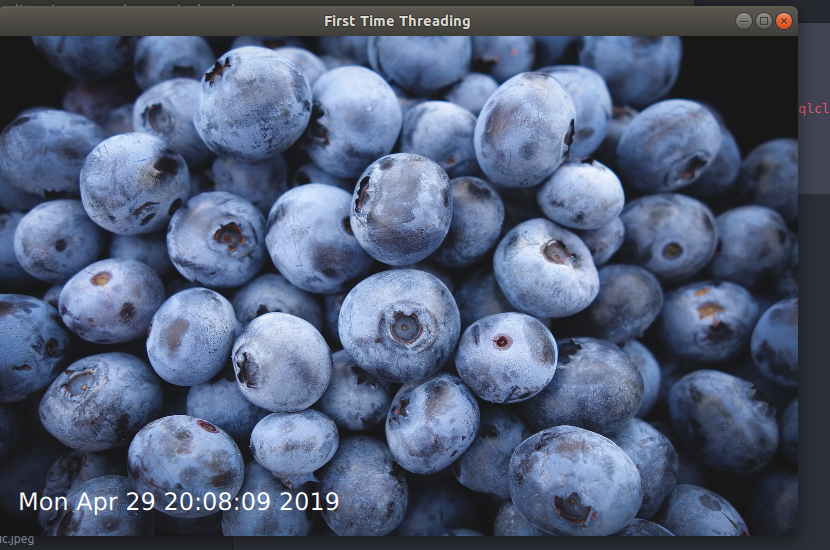

# QML Project with PyQt5

### This a Simple Project done with PyQt5 Show how to use Signal and Slot and Python as an Backend instead of C++

#images



# How to Run This Project

1. install Python 3
2. install PyQt5

```python
pip install PyQt5
```

3. In Project Directory Simple run

```python
python main.py
```
